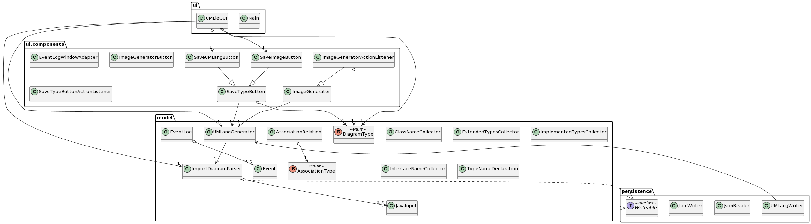

# UMLie

*Note to TA:* please see commit `c27a7a3a1abe05b5f5c5a4ee0d32b0e90de0c3c0` for
a running AutoTest
submission before the deadline. [Here](https://github.students.cs.ubc.ca/CPSC210-2022W-T1/project_h4i7d/compare/c27a7a3a1abe05b5f5c5a4ee0d32b0e90de0c3c0..main)
is a list of the changes that
were made between that commit and the latest version. My last few commits
fixed an
issue with my `Project-Starter.iml` file not getting
the right dependencies and causing the Autobot container to timeout (after the
deadline), but please grade
the
latest
commits if possible!

---

A UML generator for Java projects.


## Background

When I was first going through the pre-lecture work for B1, I felt that the
process of analyzing imports and package relationships was getting a bit
repetitive after the first few examples. I was curious if this work could be
automated. After some searching, I found that IntelliJ itself has
a [built-in feature](https://www.jetbrains.com/help/idea/class-diagram.html) to
do just that — but the version of IntelliJ with that feature is more than $200 a
year.

This application will have similar, but more limited features, to the
IntelliJ Class Diagram Generator.
Users will be able to visualize the three types of diagrams we covered in
CPSC210 from a codebase:

- package / class relationship diagrams
- call graph (*inter-method*) diagrams
- control flow (*intra-method*) diagrams

### Why this project?

I wanted to challenge myself with a project that dives deeper into how Java
works at a more technical level, because I've never worked with AST parsers
in any language. As well, this project will be useful for me personally to
check my work for practice problems, so I'm excited to take this on!

<details><summary>Implementation details</summary>
Like other programming languages, Java has an underlying abstract syntax tree (
AST) that contains the symbols and branches making up an application. Existing
applications can parse a piece of Java code into its AST, from which I can
extract the individual imports and statements. Other tools exist to visualize
files written in Unified Modeling Language (UML) into diagrams. This application
aims to be the go-between for the AST parser to the visualizer, and leverage
existing libraries to handle parsing and visualizing.
</details>

### Who will use it?

- Java software developers who wish to get an overview of software systems
  quickly.
- CPSC210 students who wish to practice drawing UML diagrams and
  cross-check them against a generated solution.

## User Stories

- [X] As a user, I want to be able to create a new diagram. (Phase 1)
- [X] As a user, I want to be able to enter the contents of a Java file to
  visualize. (Phase 1)
- [X] As a user, I want to be able to choose a Java file to visualize from my
  filesystem. (Phase 2)
- [X] As a user, I want to be able to choose a new Java file to add to a list of
  files to be visualized. (Phase 1)
- [X] As a user, I want to be able to choose the type of diagram I want to
  visualize (package / class relationship, call graph, or control flow).
- (Phase 1)
- [X] As a user, I want to be able to create a package relationship
  diagram with the files I've added to my diagram. (Phase 1)
- [X] As a user, I want to be able to create a class relationship
  diagram with the files I've added to my diagram. (Phase 1)
- [X] As a user, I want to be able to create a class import
  diagram with the files I've added to my diagram. (Phase 1)
- [X] As a user, I want to be able to see the diagram generated within the
  application. (Phase 3)
- [X] As a user, I want to be able to save the generated diagram to a PNG or
  JPEG
  image file. (Phase 3)
- [X] As a user, I want to be able to save the generated diagram to a UML
  file (Phase 2).
- [X] As a user, I want to be able to save my current diagram to a file (Phase
  2).
- [X] As a user, I want to be able to load a diagram from a saved diagram file (
  Phase 2).
- [X] As a user, I want to be prompted to save my current diagram before
  quitting (Phase 2).

## Sources Used

While working through the phases, I referenced several StackOverflow /
documentation sources. They are listed below, and also in code comments
beside where I referenced them.

- [https://stackoverflow.com/a/65733145](https://stackoverflow.com/a/65733145)
- [https://github.com/javaparser/javasymbolsolver-maven-sample](https://github.com/javaparser/javasymbolsolver-maven-sample)
- [A4 Lecture Ticket Archive](https://learning.edge.edx.org/course/course-v1:UBC+CPSC210+all/block-v1:UBC+CPSC210+all+type@sequential+block@00477d6854fd4fadbf9d1b3955f2f6ff/block-v1:UBC+CPSC210+all+type@vertical+block@c66e75437ff0423eb0fbcd287bab8563)
- [TellerApp](https://github.students.cs.ubc.ca/CPSC210/TellerApp)
- [PlantUML documentation](https://plantuml.com/api)
- [Java Swing documentation](https://docs.oracle.com/javase/tutorial/uiswing/layout/visual.html)
- [https://stackoverflow.com/a/65487077](https://stackoverflow.com/a/65487077)

## Instructions for Grader

### Adding Multiple Java Inputs to the Diagram (#1)

To add multiple Java inputs to the diagram, click the 'Add Java file' in the
lower-left corner. Select a Java file in the file-picker popup (several have
been
provided in
`test/files` for your convenience) and click 'OK'. The file will then be
added to the list panel on the left-hand side of the GUI.

This can be repeated an arbitrary amount of times, as the list will scroll
as it overflows.

### Removing Java Inputs from the Diagram (#2)

To remove Java inputs from the diagram, select the input and press
<kbd>Delete</kbd> (the keyboard key). The Java file will be deleted, and the
next time the diagram is generated, the diagram will not include the file.

(To remove Java inputs in bulk, press the 'Clear all files' button in the
lower-middle. This clears the entire diagram and resets program state.)

### Accessing Visual Component

The visual component of the project is the UML diagram that is generated on
the right-hand side of the GUI. To access it, load some Java files (for
convenience, a UMLie save file is available in `data/testReaderAllFiles.
json`) and click one of the diagram types below the placeholder pane. The
related UML diagram type will be generated and displayed.

### Saving Application State

To save application state, click 'Save UMLie file' on the lower-left side.
Enter a filepath and file name in the file-picker, and click 'OK'. The
program state will be saved to JSON in the specified location.

### Loading Application State

To load application state, click 'Load UMLie file' on the lower-left side of
the GUI. Enter a filepath in the file-picker, and click 'OK' (for
convenience, see existing save files in `data/`). The files will be loaded,
and the program will be ready to generate diagrams - click one of the
diagram types on the lower-right side.

## Phase 4: Task 2

Sample input was generated by loading `data/testReaderAllFiles.json`,
generating a class relationship diagram, deleting the `flyer-app` Java input,
generating a class import diagram, clearing all files, then quitting.

Loading the `data/testReaderAllFiles.json` file (or any UMLie save file)
will print individual `JavaInput with name [x] added.` log statements.
However, clearing the parser's list of Java inputs does not print separate
`JavaInput with name [x] removed.` statements because the input list
clearing function is distinct from the removal function.

Nothing is logged when the program runs if no actions are taken (i.e. no inputs
are
added and no
diagrams generated).

```text
UMLie Event Log:
Mon Nov 21 14:32:42 PST 2022
JavaInput with name flyer-interface added.
Mon Nov 21 14:32:42 PST 2022
JavaInput with name launcher added.
Mon Nov 21 14:32:42 PST 2022
JavaInput with name flyer-app added.
Mon Nov 21 14:32:42 PST 2022
JavaInput with name plane-class added.
Mon Nov 21 14:32:42 PST 2022
JavaInput with name seagull added.
Mon Nov 21 14:32:44 PST 2022
Class relationship diagram generated.
Mon Nov 21 14:32:47 PST 2022
JavaInput with name flyer-app removed.
Mon Nov 21 14:32:48 PST 2022
Class import diagram generated.
Mon Nov 21 14:32:51 PST 2022
JavaInputs cleared.
```

## Phase 4: Task 3

This UML diagram was primarily generated by UMLie, though minor edits were
made (removing `ui.UMLieConsoleApp` and adding enums) by hand.



While working through the Design modules and reflecting on the state of my
project, I identified several possible future improvements:

The bulk of the parsing work and diagram generation work happens in two
main classes, `model.ImportDiagramParser` and `model.UMLangGenerator`.
Each of the classes covers a large range of responsibilities, so to adhere
to the Single Responsibility Principle and to increase cohesion, I would
consider refactoring `model.ImportDiagramParser` into a class for parsing
imports, a class for parsing dependencies, a class for parsing associations,
a class for parsing extends / implements relationships, a class for managing
Java Inputs, and a class for parsing and generating
class / interface types. I would also consider
refactoring `model.UMLangGenerator` into 3 separate classes, one for each of its
diagram types.

There is also some medium / high coupling in the output formats expected by the
parser and the generator, and perhaps some refactoring could be done to
decrease coupling: for example, separating the UML generation logic into
separate functions that don't rely on the wrapping or formatting of others.

I'm also currently violating the Substitution principle (i.e. I'm using an
extension relationship when classes are not substitutable or really a
subclass of another)
in the
relationship between `ui.components.ImageGenerator` and `ui.components.
ImageGeneratorActionListener`, and should refactor this into a field
association relationship.

In general, some classes in `ui.components`
could likely be split up into separate utility and GUI classes to increase
cohesion.
